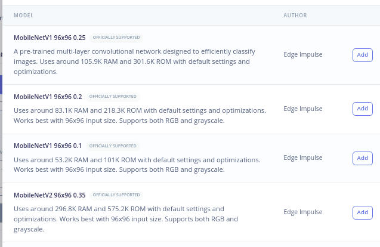
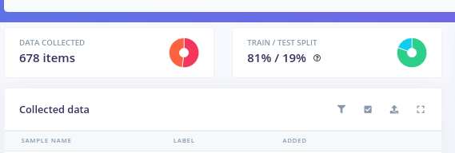
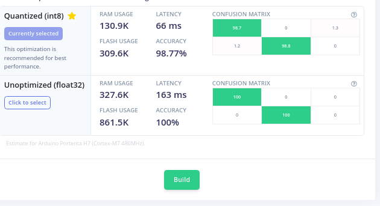
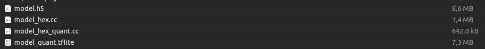

# Skin Cancer Detection Project TinyML
#### BAAZIZ ELMEHDI & OUICH JALALEDDINE & FALL OUSMANE

# 1. Introduction :
The goal of this project is to perform an image classification for skin cancer detection using the Arduino Nano 33 Sense BLE card and a camera module.
# 2. Data acquisition : 

the most crucial aspect of the project is creating the dataset. The images for cancer were obtained from the Kaggle website (https://www.kaggle.com/datasets/nodoubttome/skin-cancer9-classesisic), specifically for the skin cancer called "melanoma". The dataset contains two classes labeled as "safe_skin" and "cancer_skin".

# 3. Model's choice : 
Choosing a model is crucial for our project. We need to bear in mind the amount of RAM that is accessible while using Arduino Nano ble 33.

the choice will be  MobileNet model family.

# 5. Training : 
We will train the model with 2 different methods : 

# 5.1 Method 1 : Edge Impulse 
# 5.1.1 Step 1 : Data Acquisition 

Here i loaded 678 photos splitted : 
 80%  for trainning.
 20%  for test.
# 5.1.2 Step 2: Create Impulse

# 5.1.3 Model testing & deployement
As you can see, we have a relatively strong model.

# 5.1 Method 1 : Google Colab
We based our work on this tutoriel in Google Colab (https://gist.github.com/gheesung/eb0076e040ba53d5be2ad2db1c70cf82)

After the training, we get the following files 

We need to do more few changes before deploy our model.Modify model_settings.cpp by changing kNumChannels to 3 (for red, green, and blue) and kCategoryCount to 2 in model_settings.h because we have 2 classes.

# Result

