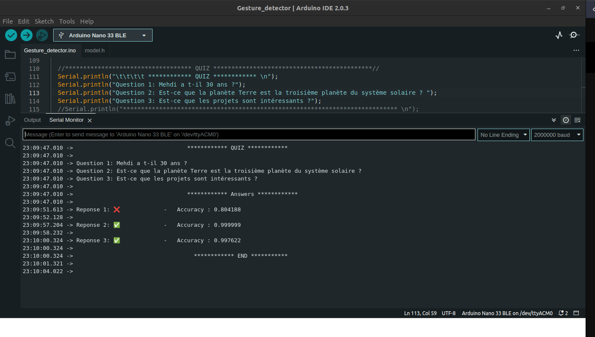

En utilisant ce programme Arduino, on prut répondre aux question en faisant des gestes avec l'arduino.
L'Arduino va détecter le mouvement , et elle ve utiliser un modèle entrainé pour la reconaissance du geste.
L'entraienement de ce modèle a été fait via Collab et en se basant sur les elements du cours.
l'output de ce programme est comme suit :

